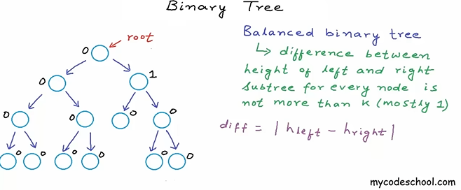

# **Estruturas de Dados**

## **Aula 16: Árvores Binárias e Árvores Binárias de Busca**

### **Estrutura de Árvore Binária**

Uma **árvore binária** é uma estrutura de dados composta por nós, onde cada nó pode ter, no máximo, dois filhos. Esta estrutura é utilizada para organizar dados de forma hierárquica e eficiente. Uma árvore binária é caracterizada por:

- O primeiro nó é chamado de **raiz** (root) e não possui pais.
- Cada nó pode ter até **dois filhos**: o filho esquerdo e o filho direito.
- Nós sem filhos são chamados de **folhas** (leaf).
- A árvore é uma **estrutura de dados recursiva**, ou seja, as subárvores seguem o mesmo formato da árvore principal.
- A ligação entre os nós é **unidirecional**, e nenhum nó pode apontar para a raiz.

#### Propriedades de uma Árvore Binária:
- A profundidade de um nó é a distância entre ele e a raiz.
- A altura de um nó é o caminho mais longo da raiz até uma folha.
- Em uma árvore com **N** nós, haverá exatamente **N - 1** ligações.
- Em uma árvore binária completa, todos os níveis, exceto o último, estão preenchidos.
- O **máximo número de nós** em um nível \( i \) é igual a \( 2^i \).
- O **máximo número de nós** em uma árvore de altura \( h \) é \( 2^{h+1} - 1 \).
- A **altura de uma árvore completa** é \( \log_2(n + 1) - 1 \), onde \( n \) é o número de nós.
- A árvore binária pode ser **balanceada**, o que significa que a diferença entre a altura das subárvores esquerda e direita é, no máximo, \( k \) (geralmente \( k = 1 \)).

#### Aplicações de Árvores Binárias:
1. Armazenar dados hierárquicos, como sistemas de diretórios e arquivos.
2. Organizar dados para acesso eficiente em estruturas como heaps.
3. Representação de expressões matemáticas e lógicas.

#### Implementação de Árvores Binárias:
- **Por meio de ponteiros**: Nós dinamicamente alocados que referenciam outros nós.
- **Por meio de vetores**: Cada nó em um índice \( i \) tem:
  - Filho esquerdo no índice \( 2i + 1 \).
  - Filho direito no índice \( 2i + 2 \).

### **Árvore Binária de Busca (BST)**

Uma **Árvore Binária de Busca (BST)** é uma árvore binária com uma propriedade adicional: a **ordem** dos nós. Nessa estrutura, cada nó segue as seguintes regras:

- Todos os valores na **subárvore esquerda** de um nó são menores que o valor do nó.
- Todos os valores na **subárvore direita** de um nó são maiores que o valor do nó.

Note que é uma estrutura recursiva.

Baseada na busca binária em um vetor:

Essa propriedade torna a **pesquisa, inserção e remoção de elementos** mais eficiente, com complexidade **O(log(N))** em uma árvore balanceada. Fazendo uma breve comparação entre a complexidade de cada tipo de estruturas de dados, temos:

Onde o custo da BST é (no melhor caso) O(logn) e no pior caso O(n), que pode ser evitado se tivermos certeza de que essa árvore está sempre balanceada.

#### Propriedades da Árvore Binária de Busca:
- A **altura da árvore** impacta diretamente a eficiência das operações. Quanto menor a altura, melhor o desempenho.
- A altura de uma árvore binária de busca idealmente seria \( O(\log_2 n) \), mas, no pior caso (quando a árvore está desequilibrada), a altura pode ser \( O(n) \).
- Uma árvore binária de busca é dita **completa** quando todos os níveis, exceto possivelmente o último, estão preenchidos, e o último nível tem todos os nós à esquerda.

#### Exemplo de Árvore Binária de Busca:

#### Operações em uma Árvore Binária de Busca:
- **Busca**: Começa na raiz e decide entre a subárvore esquerda ou direita, dependendo do valor procurado.
- **Inserção**: O novo valor é inserido como uma folha na posição correta, respeitando a ordem dos nós.
- **Remoção**: Há três casos para a remoção de um nó:
  - O nó é uma folha (simplesmente removido).
  - O nó tem um filho (o filho substitui o nó).
  - O nó tem dois filhos (substituído pelo menor valor na subárvore direita ou o maior na subárvore esquerda).

#### Implementação de Árvore Binária de Busca:
Assim como nas árvores binárias comuns, as árvores binárias de busca podem ser implementadas de duas formas principais:
1. **Com nós dinamicamente alocados**, onde cada nó aponta para seus filhos esquerdo e direito.
2. **Com vetores**, onde o índice de um nó segue as mesmas regras de uma árvore binária: 
   - Filho esquerdo no índice \( 2i + 1 \).
   - Filho direito no índice \( 2i + 2 \).

#### Balanceamento:
- Para garantir a eficiência da árvore, é importante que ela seja **balanceada**, ou seja, que a diferença entre as alturas das subárvores de um nó seja, no máximo, 1.
- Algoritmos como **AVL** e **Red-Black Trees** são usados para manter a árvore balanceada.

#### Exemplo de Árvore Binária de Busca Balanceada:

Application memory:

- Code (Text): Comandos do algoritmo enviados ao compilador
- Static/Global: Variáveis acessíveis globalmente
- Stack: Variáveis acessíveis internamente (em funções, por exemplo)
- Heap: Espaço livre para alocar/desalocar variáveis dinamicamente

